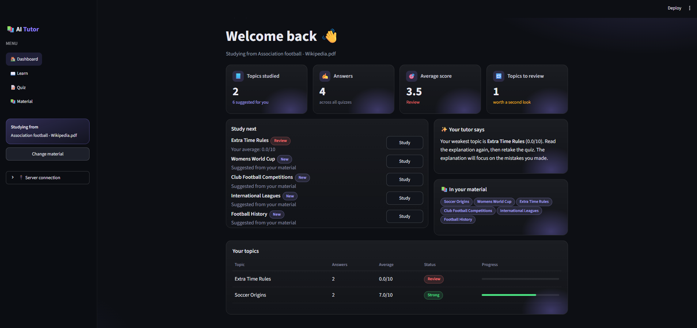
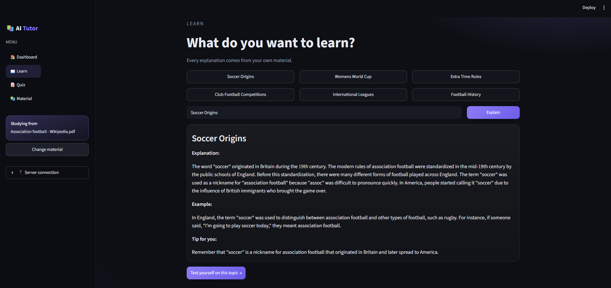
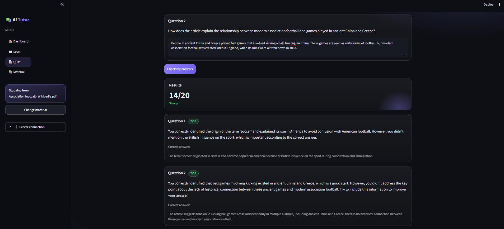
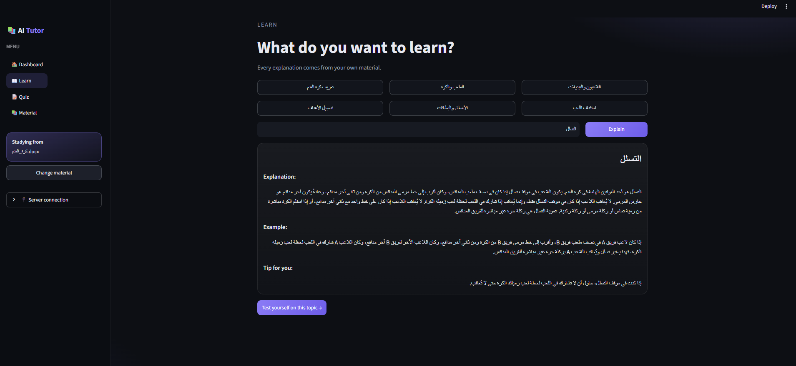

# 🚀 [Tips Hindawi](https://www.tipshindawi.com/) Internship (August–October) 2026

> 🎓 This project was built during the [ **Tips Hindawi** ](https://www.tipshindawi.com/) **Internship (August–October) 2026**.

## 👤 Participant

| Field            | Value                                |
| ---------------- | ------------------------------------ |
| Full Name        | Abdelrahman Mohamed Galal            |
| Project Name     | AI Personal Tutor                    |
| GitHub Username  | [Abdelrahman-Galal-00](https://github.com/Abdelrahman-Galal-00) |
| Internship Batch | August–October 2026                  |
| Training Program | Large Language Models (LLMs) Program |
| Organization     | [**Edrak for Ai**](https://edrak4ai.com/en)                         |

---

# 📖 Project Overview

AI Personal Tutor teaches students from **their own study material**. The student uploads a book or lecture notes, and the tutor suggests topics, explains them, writes quizzes, grades the answers with feedback, and remembers the student's mistakes so it can focus on them next time.

Every explanation and question comes from the uploaded material using **RAG**, not from the model's general knowledge. The tutor works with both **English and Arabic** material.

---

# ✨ Features

* **Learn from your own material:** upload a PDF, DOCX, EPUB or TXT file, in English or Arabic.
* **Suggested topics:** after uploading, the tutor suggests topics from across the whole material.
* **Explanations:** each topic comes with an explanation, an example, and a personal tip.
* **Quizzes:** 1 to 10 short-answer questions, with easy, medium or hard difficulty.
* **Grading with feedback:** every answer gets a score out of 10 and feedback. Empty or unrelated answers get 0.
* **Memory:** the tutor keeps the student's scores per topic. When the student returns to a weak topic, the explanation focuses on the mistakes made before.
* **Dashboard:** progress cards, a "Study next" list (weak topics first), and a table of every topic with its average.
* **Arabic support:** multilingual model and embeddings, right-to-left display, and a warning when an Arabic PDF is uploaded.

---

# 🛠️ Technologies Used

| Part | Tool |
|---|---|
| Model | Qwen2.5-7B-Instruct, quantized to 4-bit (bitsandbytes NF4) |
| Embeddings | paraphrase-multilingual-MiniLM-L12-v2 |
| Vector store | FAISS |
| LLM framework | LangChain (PromptTemplate, LLMChain, StructuredOutputParser) |
| Server | FastAPI + Uvicorn, exposed with ngrok |
| GPU | Kaggle (2× T4) |
| Interface | Streamlit |

**How it works:**

1. **RAG:** the uploaded file is cleaned (repeated headers and footers are removed), split into chunks, embedded, and stored in FAISS. For each request, the closest chunks are retrieved and given to the model as context.
2. **Chains:** four LangChain chains: explain a topic, write a quiz, grade an answer, and suggest topics.
3. **Output parsers:** the quiz, grading and topic chains return JSON, which is parsed into Python data so the code can use the score as a number and keep the correct answers. Every call retries if the JSON is broken.
4. **Memory:** scores and feedback are stored per topic and added to the explanation prompt as notes about the student.
5. **Serving:** the model runs on a Kaggle GPU behind a FastAPI server exposed with ngrok. The Streamlit app runs locally and calls the server with an access key.

---

# ⚙️ Installation

**Requirements:** a Kaggle account, a Hugging Face token, and a free ngrok token.

**1. Start the server on Kaggle**

1. Import the notebook from the `server/` folder into Kaggle.
2. In Settings, set the accelerator to **GPU T4 x2** and turn the internet **on**.
3. Run all the cells. You will be asked for your Hugging Face token and your ngrok token.
4. The last cell prints a **server link** and an **access key**.

**2. Start the app on your computer**

```bash
cd app
pip install -r requirements.txt
python -m streamlit run app.py
```

> No tokens are stored in the code. The access key is created randomly each time the server starts.

---

# 🚀 Usage

1. In the app's sidebar, open **🔌 Server connection**, paste the server link and access key, and click **Connect**.
2. Upload your material from the dashboard.
3. Pick a topic from **Study next**, or type one in **Learn**, and click **Explain**.
4. Click **Test yourself on this topic**, choose the number of questions and the difficulty, then answer and click **Check my answers**.
5. Go back to the **Dashboard** to see your progress and the topics you should review.

---

# 📸 Demo

| Dashboard | Explanation |
|---|---|
|  |  |

| Quiz results | Arabic material |
|---|---|
|  |  |

The English demo material is the Wikipedia article on association football (CC BY-SA). The Arabic demo material is a short summary of the rules of football written for this project.

---

# 📈 Results

* A complete tutor that works with **any material** the student uploads, in **English and Arabic**.
* 4-bit quantization reduced the model from **~15 GB to ~5.5 GB**, so it runs on a free Kaggle GPU.
* Problems found during testing and solved:
  * The model drifted into Chinese with Arabic material → fixed with a system message, a lower temperature, and an automatic check that regenerates the reply.
  * Quiz questions mentioned figures the student can't see → fixed with prompt rules.
  * The model gave points for nonsense answers → fixed with strict grading rules.
  * Broken JSON from the model → fixed with correct schema types, retries, and a backup parser.
  * Arabic text taken out of PDFs has merged words → the app warns the user and suggests DOCX, EPUB or TXT.
* **Limitations:** each reply takes around 20 to 40 seconds on the free GPU, scanned PDFs are not supported, and the memory supports one student at a time and is cleared when the server restarts.

---

# 🔮 Future Improvements

* Read scanned PDFs and photos of notes using OCR or a vision model.
* A separate, saved memory for each student, stored in a database.
* Faster replies with vLLM, a stronger GPU, or streaming the text as it is written.
* Multiple-choice quizzes that are graded instantly.

---

# 📚 About the Internship

This project was developed as part of the [**Tips Hindawi**](https://www.tipshindawi.com/) **Internship (August–October) 2026**, and it will be showcased on the official [Tips Hindawi](https://www.tipshindawi.com/) website.

[Tips Hindawi](https://www.tipshindawi.com/) is the internships department of [**Edrak for Ai**](https://edrak4ai.com/en), and the internship encourages participants to build real-world projects, apply practical skills, and showcase their work through GitHub.

For more information about the internship, training programs, and upcoming batches, visit the official [Tips Hindawi](https://www.tipshindawi.com/) website.

---

# 📄 License

This project is shared for educational and portfolio purposes.
